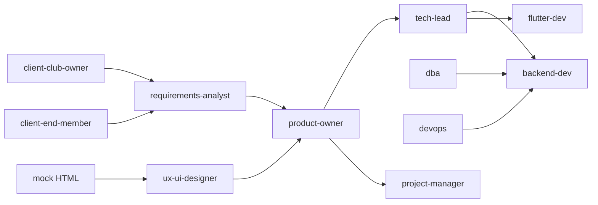

# Orquestração multi-agente

Este documento define **como executar vários agentes em paralelo**, cada um com seu chapéu, usando os arquivos em [`../agents/`](../agents/).

## Princípios

1. **Uma fonte de verdade compartilhada:** `docs/`, `mock/index.html`, Notion sincronizado.
2. **Contratos entre agentes:** entregáveis em Markdown/JSON, não apenas chat.
3. **Paralelismo seguro:** agentes que tocam o mesmo arquivo devem trabalhar em branches ou pastas distintas.
4. **Simulação de cliente** antes de fechar requisitos do MVP.

## Grafo de dependências (Fase 0)



## Ondas de execução paralela

### Onda 1 (paralelo — sem dependências)
| Agente | Entregável | Pasta |
|--------|------------|-------|
| `requirements-analyst` | Atualizar `docs/02-REQUISITOS.md` | docs/ |
| `client-club-owner` | `agents/outputs/club-owner-feedback.md` | agents/outputs/ |
| `client-end-member` | `agents/outputs/member-feedback.md` | agents/outputs/ |
| `ux-ui-designer` | Revisar/evoluir `mock/index.html` | mock/ |
| `project-manager` | Atualizar cronograma no Notion | notion/ |

### Onda 2 (após Onda 1)
| Agente | Entregável |
|--------|------------|
| `product-owner` | Priorizar `docs/03-BACKLOG` + CSV Notion |
| `tech-lead` | ADRs em `docs/04-ARQUITETURA-FLAVORS.md` |
| `dba` | Schema em `docs/05-API-E-BANCO.md` |

### Onda 3 (implementação)
| Agente | Branch sugerida |
|--------|-----------------|
| `backend-dev` | `cursor/api-foundation-5ac5` |
| `flutter-dev` | `cursor/flutter-flavors-5ac5` |
| `devops` | `cursor/cicd-pipeline-5ac5` |
| `qa-automation` | `cursor/e2e-critical-5ac5` |
| `technical-writer` | `cursor/docs-user-5ac5` |

## Prompt template (Cursor / Cloud Agent)

```
Você é o agente <AGENT_ID>. Leia agents/<AGENT_ID>.md e siga missão, entradas e saídas.
Contexto obrigatório: docs/02-REQUISITOS.md, mock/index.html.
Não altere arquivos fora do seu escopo definido no manifesto do agente.
Entregue: <lista de arquivos> e checklist de DoD.
```

## Resolução de conflitos

| Conflito | Árbitro |
|----------|---------|
| Escopo MVP | product-owner + client simulators |
| Arquitetura | tech-lead |
| Prazo vs escopo | project-manager + product-owner |
| UX vs viabilidade técnica | tech-lead + ux-ui-designer |

## Métricas dos agentes

- Tempo por entregável
- Taxa de retrabalho (histórias devolvidas)
- Cobertura de RF no backlog

## Registro de execução

Manter em Notion database **Agent Runs**:

| Campo | Tipo |
|-------|------|
| agent_id | Select |
| sprint | Relation |
| started_at | Date |
| output_links | URL |
| status | Select: running, done, blocked |
