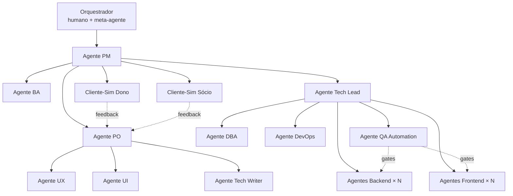
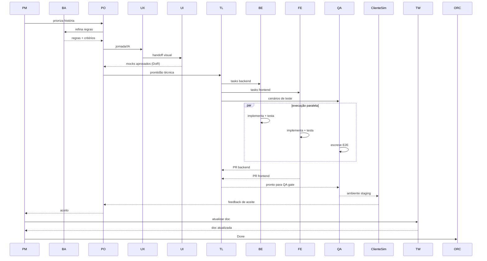

# Orquestração

## Topologia



## Papéis da orquestração

- **Orquestrador humano**: você (e/ou um meta-agente). Decide quem entra em campo, aprova decisões irreversíveis, resolve impasses.
- **PM**: regente — coordena ritmo, prioriza, mantém visão.
- **Tech Lead**: garante coerência técnica entre devs em paralelo.
- **Cliente-Sim**: valida a entrega "como cliente faria", **antes** do Done.

## Fluxo padrão de uma história



## Mecânica do hand-off

Cada hand-off é um artefato:

| De → Para | Artefato | Localização |
|---|---|---|
| PM → PO | "Slot priorizado" no quadro | Notion / Backlog |
| PO → BA | "Refinement card" | Notion / Story page |
| BA → PO | "Regras + critérios" | Mesma página, seção dedicada |
| PO → UX | "UX brief" | Notion + link Figma |
| UX → UI | "IA + jornada" | Figma + Notion |
| UI → PO | "Mocks v1" | Figma link com versão fixa |
| PO → TL | "DoR check" | Checkbox no card |
| TL → Dev | Tasks B-* / F-* / Q-* | GitHub Issues |
| Dev → TL | PR | GitHub |
| TL → QA | "Ready for QA gate" | Label no PR |
| QA → SIM | "Ready for sim" | Notion + link staging |
| SIM → PO | "Sim report" | Notion (template estruturado) |
| PO → PM | "Aceito" | Status do card |
| PM → TW | "Liberado p/ doc" | Label no card |

## Paralelismo

Regras práticas:

- **2 backends paralelos** dentro do mesmo bounded context: ok, desde que toquem agregados diferentes.
- **2 frontends paralelos**: ok, com features independentes e revisão cruzada no Cask DS.
- **Múltiplas QA**: cada uma cobre uma feature; uma sempre faz o "smoke transversal" do release.
- **Cliente-Sim Dono e Sócio** rodam em paralelo, gerando feedback que vira novas tasks (ou bugs) priorizadas pelo PO.

## Quando humano entra obrigatoriamente

- Decisões arquiteturais marcadas como ADR.
- Aprovação de release de produção.
- Mudança de contrato público da API (breaking).
- Comunicação direta com cliente real (clube).
- Qualquer entrega que envolva dado de cliente real em ambiente de dev/sim.
- Aceite final do épico.

## Logging e auditoria de agentes

Toda ação de agente gera log estruturado:
```
{
  "agent": "frontend-flutter@2",
  "task_id": "F-2.3.3",
  "action": "open_pr",
  "artifact": "https://github.com/.../pull/123",
  "elapsed_s": 482,
  "next": "review by tech-lead"
}
```
Logs alimentam um painel "Agent ops" para o orquestrador ver throughput, hand-off lentos e gargalos.
