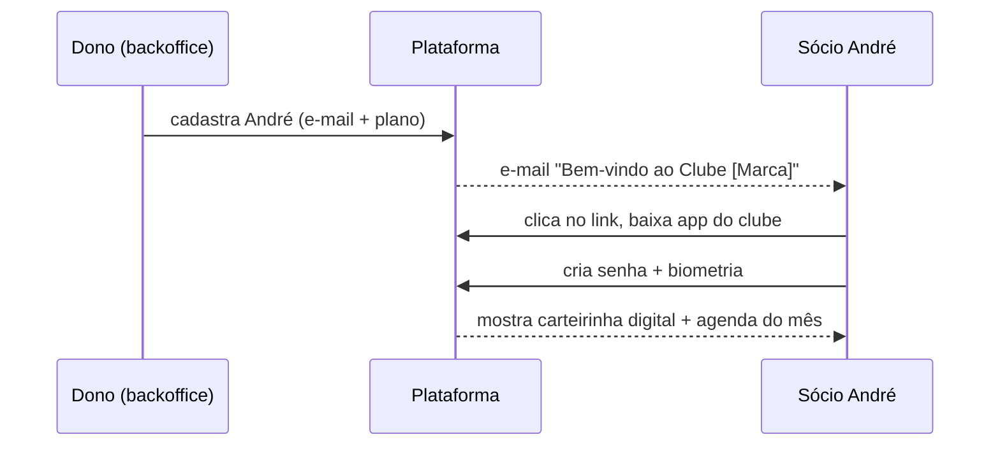
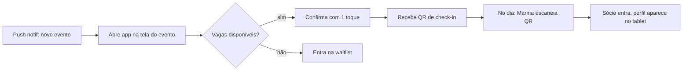
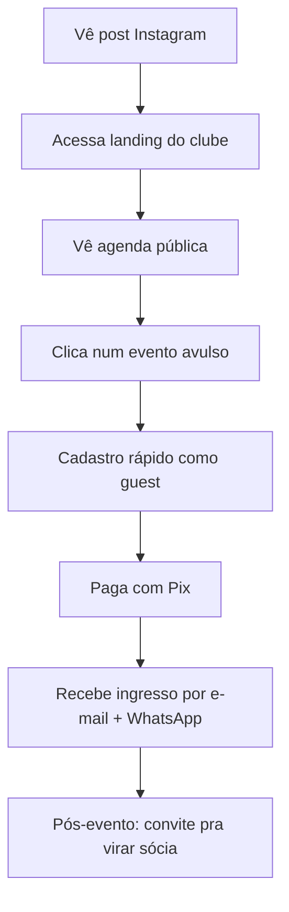
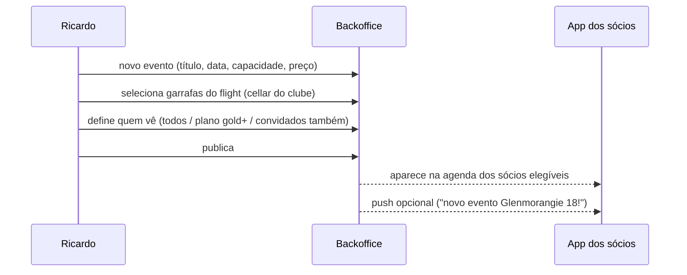
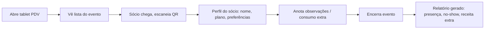
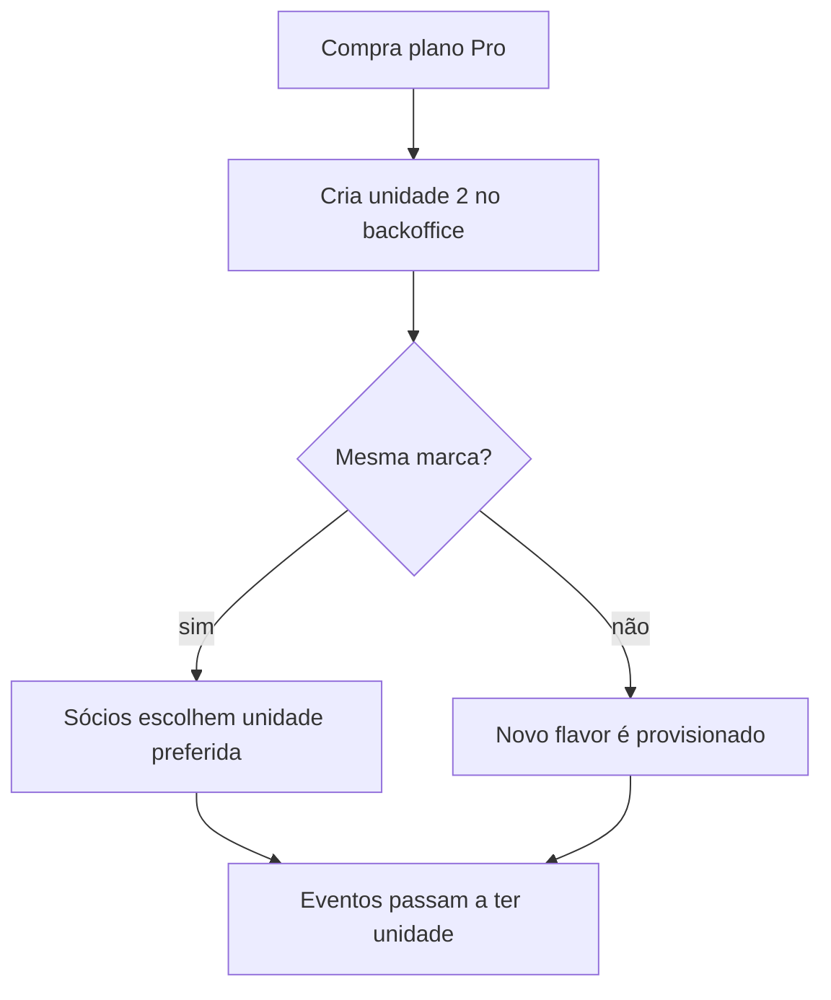

# Jornadas de Usuário

Diagramas em mermaid. Cada jornada destaca os pontos onde o **multi-agente** durante o desenvolvimento precisa de atenção (UX, Back, DBA, QA).

## J1 — André recebe convite e ativa sua conta

**Pontos críticos**:
- Deep link com tenant_id correto.
- Onboarding < 90s.
- Carteirinha precisa funcionar offline.

## J2 — André confirma presença num evento

## J3 — Camila descobre o clube e compra um evento avulso

## J4 — Ricardo cria um evento no backoffice

## J5 — Marina opera a noite do evento

## J6 — Ricardo escala para 2ª unidade

---

## Mapa Jornada × Épico

| Jornada | Épico no backlog |
|---|---|
| J1 | E1 — Identidade & Membership |
| J2 | E2 — Agenda & Eventos |
| J3 | E3 — Aquisição & Public funnel |
| J4 | E4 — Backoffice Eventos |
| J5 | E5 — Operação na unidade |
| J6 | E6 — Multi-unidade & Flavor Provisioning |
