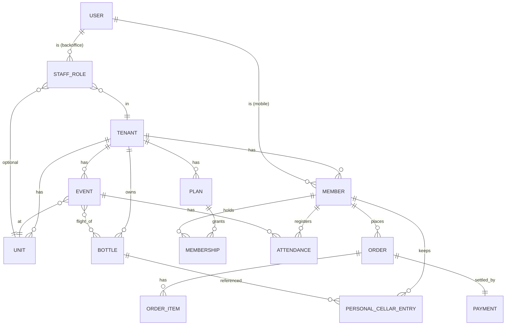

# Modelo de Dados (alto nível)

> Esquema lógico. SQL DDL e migrations virão no repositório do backend; aqui é o mapa para alinhar PO/Back/DBA/QA.

## Entidades principais

## Tabelas (resumo)

### Identidade & Tenancy
- **users**: id, email, password_hash, phone, kind (member|staff|guest), birthdate, lgpd_consent_at.
- **tenants** (clubes): id, slug, display_name, flavor_config jsonb, created_at, status.
- **units**: id, tenant_id, name, address, timezone.
- **staff_roles**: user_id, tenant_id, unit_id (nullable), role (owner|manager|curator|reception), permissions jsonb.

### Membership
- **plans**: id, tenant_id, name, price_cents, billing_cycle (monthly|annual), benefits jsonb.
- **members**: id, tenant_id, user_id, member_number, joined_at, preferences jsonb.
- **memberships**: id, member_id, plan_id, status (active|paused|canceled), started_at, ends_at, next_billing_at.
- **digital_cards**: member_id, secret_hash, version (rotacionado).

### Eventos
- **events**: id, tenant_id, unit_id, kind, title, description_md, starts_at, ends_at, capacity, price_cents, visibility (all|plan_ids|public), status (draft|published|happening|closed|canceled).
- **event_flight** (n-m): event_id, bottle_id, order, notes.
- **attendances**: id, event_id, member_id (nullable se guest), guest_email, status (confirmed|waitlist|checked_in|no_show|canceled), created_at, checked_in_at.

### Cellar
- **bottles**: id, tenant_id, name, distillery, region, country, type (single_malt|blend|bourbon|...), age, abv, vintage, image_url, notes_md, curator_user_id.
- **personal_cellar_entries**: id, member_id, bottle_id, status (tasted|owned|wanted), member_notes_md, rating (1-5), tasted_at.

### Commerce & Billing (F2+)
- **orders**: id, tenant_id, member_id (nullable), unit_id, kind (event_ticket|bottle|membership), status, total_cents, created_at.
- **order_items**: order_id, sku, qty, unit_price_cents.
- **payments**: id, order_id, provider, provider_ref, status, amount_cents, paid_at.
- **invoices** (SaaS billing): tenant_id, period, amount_cents, status.

### Notificações
- **notifications_inbox**: id, user_id, tenant_id, kind, payload, read_at.
- **comm_consents**: user_id, channel (email|push|whatsapp), opted_in.

### Auditoria
- **audit_log**: id, tenant_id, actor_user_id, action, target_kind, target_id, diff jsonb, occurred_at (append-only, particionado por mês).

## Convenções

- IDs: UUID v7 (ordenáveis no tempo).
- Timestamps: `created_at`, `updated_at` em UTC; conversão para timezone do clube na borda.
- Soft delete só onde regulatório (membros: anonimização ao invés de delete).
- `tenant_id` na primeira coluna de toda PK composta de índices secundários.

## Particionamento futuro

- `audit_log`: por mês (`PARTITION BY RANGE (occurred_at)`).
- `notifications_inbox`: por mês quando passar de ~10M linhas.

## Backups & retenção

- Snapshot diário (35 dias) + WAL contínuo (PITR 7 dias).
- Backup criptografado em bucket separado de conta.
