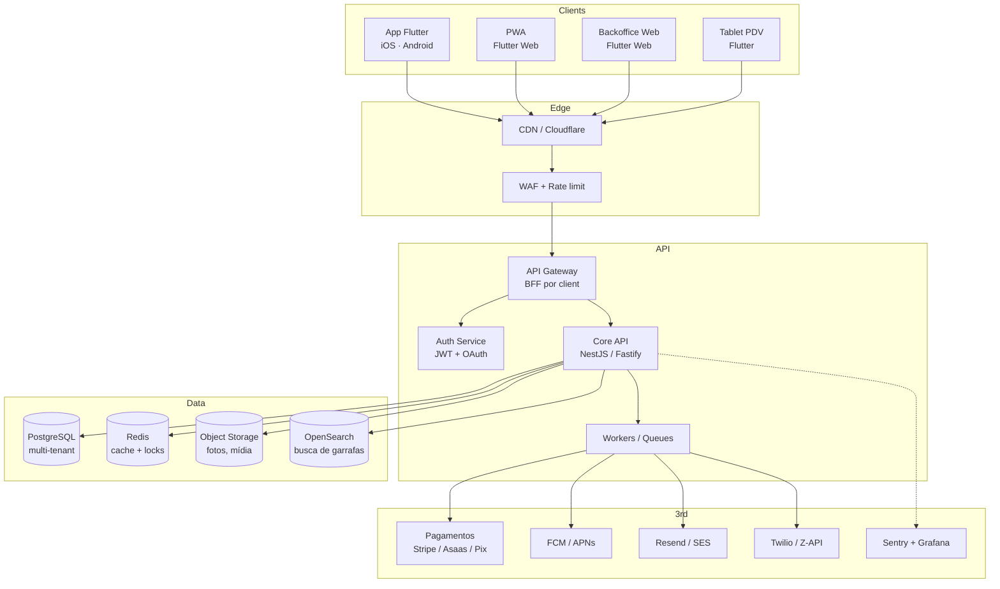

# Arquitetura de Alto Nível

## Visão em uma figura



## Princípios arquiteturais

1. **API-first**: contrato OpenAPI 3.1 versionado, gerado e publicado em CI. App não conhece o banco.
2. **Multi-tenant por `tenant_id`**: todo registro tem `tenant_id` indexado; queries são forçadas a filtrar por ele via middleware (Row-Level Security no Postgres como segunda barreira).
3. **BFF por client**: gateway expõe versões enxutas por tipo de cliente (mobile-sócio, backoffice, tablet-pdv) para evitar over-fetch.
4. **Eventual consistency onde dá** (notificações, relatórios) via fila; **strong consistency onde paga** (cobrança, check-in).
5. **Idempotência por padrão** em escritas via `Idempotency-Key` header.
6. **Feature flags** por clube (Unleash / GrowthBook self-hosted).

## Stack proposta

| Camada | Escolha | Por quê |
|---|---|---|
| App (mobile + web) | **Flutter 3.x** + Riverpod + go_router | Codebase único, flavorização nativa, bom DX |
| Linguagem backend | **TypeScript** (Node 20) com **NestJS** ou **Fastify+tsoa** | Tipagem forte, ecossistema, gera OpenAPI |
| Banco | **PostgreSQL 16** | RLS multi-tenant, JSONB para metadados de flavor, extensões geo |
| Cache / locks | **Redis 7** | Sessão, rate-limit, idempotência, locks de check-in |
| Filas | **BullMQ** (Redis) | Simples, observável, retry/backoff |
| Busca | **OpenSearch** (Fase 2) | Busca facetada de garrafas (região, estilo, idade) |
| Storage | **S3-compatible** (R2 / DO Spaces / AWS S3) | Custo, CDN nativa |
| Pagamentos | **Stripe** + **Asaas** (BR) + **Pix** direto | Cobertura cartão internacional + BR + recorrência |
| Push | **FCM** (Android + iOS via APNs) | Padrão |
| E-mail | **Resend** ou **SES** | Bom DX e custo |
| WhatsApp | **Z-API** (BR) ou **Twilio** | Z-API mais barato pra BR |
| Auth | JWT (access curto + refresh) + OAuth (Google, Apple) | Mobile-friendly |
| Observabilidade | **OpenTelemetry** + **Grafana stack** + **Sentry** | Open + dono dos dados |
| Infra | **Docker** + **Kubernetes** (GKE/EKS) ou **Fly.io/Render** em F1 | Começa simples (Render), migra pra K8s em F2 |
| IaC | **Terraform** + **Helm** (quando K8s) | Padrão de mercado |
| CI/CD | **GitHub Actions** + **Codemagic** (builds Flutter store) | Codemagic pra signing iOS/Android automatizado |

## Camadas do app Flutter

```
lib/
├── core/                # Cliente HTTP, auth, theming engine, i18n, errors
├── design_system/       # Componentes reutilizáveis (puro UI)
├── features/
│   ├── auth/
│   ├── membership/
│   ├── events/
│   ├── cellar/
│   ├── profile/
│   └── public/
├── flavor/              # Carrega config do flavor em runtime
│   ├── config.dart
│   └── flavors/
│       ├── clube_demo.dart
│       └── clube_piloto.dart
└── main_<flavor>.dart   # Entry-point por flavor
```

Detalhes em [`flutter-app.md`](flutter-app.md) e [`flavorization.md`](flavorization.md).

## Decisões registradas (ADRs — esqueleto)

Vamos manter ADRs em `02-architecture/adrs/`. Templates esperados:

- **ADR-0001** Flutter como framework de cliente.
- **ADR-0002** Multi-tenant por tenant_id em DB único.
- **ADR-0003** TypeScript/NestJS no backend.
- **ADR-0004** Estratégia de flavorização Flutter (`--flavor` + dart-define + assets por flavor).
- **ADR-0005** Pagamento: Stripe + Asaas + Pix direto.
- **ADR-0006** Observabilidade self-hosted vs. SaaS.
- **ADR-0007** Estratégia de versionamento de API (`/v1`, deprecação com header).

Cada ADR segue o template Michael Nygard (Context / Decision / Consequences).
