# Roadmap

> Horizonte de planejamento: até **GA público** (Onda 2 do GTM). Sem datas absolutas — usamos **fases** com critérios de saída.

## Fases

### Fase 0 — Discovery & Setup
**Objetivo**: time, repos, infra mínima, design system inicial, ambiente dev rodando.

**Entregáveis**:
- Repositório `whiskey-club-app` (Flutter) e `whiskey-club-api` (backend) provisionados.
- Pipeline CI verde (lint + test placeholder).
- Ambientes dev + staging.
- `flavor.json` base + 1 flavor demo navegável (apenas splash + home estática).
- Design tokens (Cask DS) v0.1 publicados.
- Backlog priorizado de Fase 1 e prontidão (DoR) dos top 10 itens.

**Critério de saída**: PR de "hello world" do app deploya em TestFlight + Play Internal Track, e o endpoint `/health` da API está online em staging.

---

### Fase 1 — MVP (Identidade + Eventos)
**Objetivo**: clube parceiro consegue **cadastrar sócio**, **publicar evento**, **fazer check-in**, com app branded na mão do sócio.

**Épicos**:
- E1 — Identidade & Membership
- E2 — Agenda & Eventos
- E3 — Aquisição & Funil público (mínimo)
- E4 — Backoffice Eventos
- E5 — Operação na unidade (PDV) — versão mínima
- E9 — Multi-tenant & Flavor (foundations)
- E11 — Pagamentos básico (mensalidade + ingresso avulso)

**Critério de saída**: 100% das jornadas J1, J2, J3, J4, J5 funcionam com dado real no clube parceiro, durante 30 dias contínuos, sem Sev1 fora do SLA.

---

### Fase 2 — Escala & Encantamento
**Objetivo**: produto pronto para 5–10 clubes; encantamento do sócio (push, cellar pessoal); operação multi-unidade.

**Épicos**:
- E2.1 — Eventos avançados (waitlist promo, +1, recorrência)
- E3 — Cellar pessoal do sócio
- E6 — Multi-unidade & Flavor provisioning self-service (admin global)
- E8 — Notificações push segmentadas + WhatsApp
- E10 — Dashboard & Analytics no backoffice
- E12 — Audit log no backoffice

**Critério de saída**: provisionar um novo clube com flavor próprio em **< 2 dias úteis**, ponta a ponta.

---

### Fase 3 — Comércio & Programa de Pontos
**Objetivo**: monetização adicional, retenção via gamificação leve, e-commerce de garrafas.

**Épicos**:
- E7 — E-commerce de garrafas (catálogo, checkout, retirada/entrega)
- E13 — Programa de indicação + crédito
- E14 — Conteúdo editorial in-app (artigos do curador)
- E15 — Integrações com PDV e ERP (Enterprise)
- E16 — SSO Enterprise (SAML/OIDC) e SLA Premium

**Critério de saída**: ≥ 2 clubes Enterprise rodando, MRR de e-commerce ≥ 20% do MRR total.

---

## Visualização

```mermaid
gantt
    title Roadmap (sequencial; sem datas absolutas)
    dateFormat  X
    axisFormat  Fase %s
    section Fase 0
    Setup           :a1, 0, 1
    section Fase 1
    MVP             :a2, after a1, 4
    section Fase 2
    Escala          :a3, after a2, 4
    section Fase 3
    Comércio        :a4, after a3, 4
```

## Dependências críticas

- App Flutter Fase 1 depende de: design tokens (Fase 0), API auth (Fase 0/1), assinatura iOS/Android (Fase 0).
- Push notif (Fase 2) depende de: contas FCM/APNs por flavor (provisionar em paralelo na Fase 1).
- E-commerce (Fase 3) depende de: revisão jurídica (venda de bebida alcoólica online por UF).
